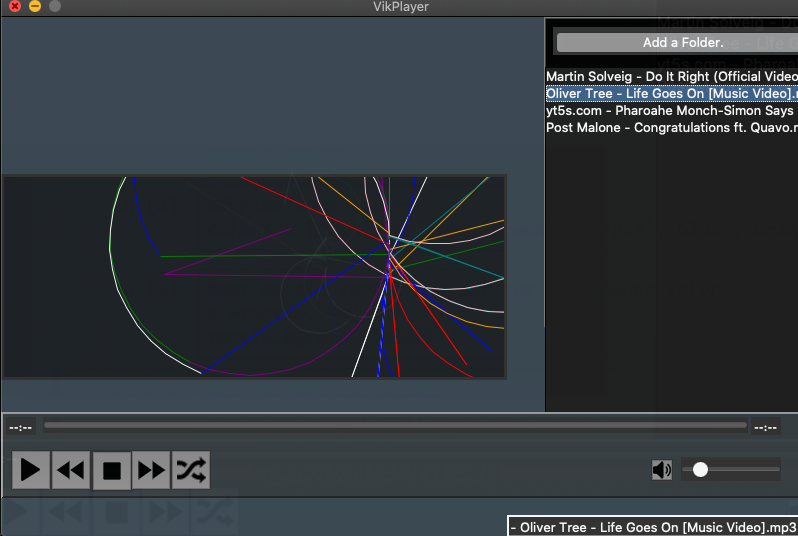

# Create a virtual environment
```python3 -m venv venv```

# Activate it
```source ./venv/bin/activate```

# Install Poetry
```pip install poetry```

# Install the project dependencies 
```poetry install```

# Update the project dependencies 
```poetry update```

## Format checks

```shell script
make lint - execute flake8

make black-check - run black check

make black - run black and format files

make mypy - run mypy on Viks-music-player and tests

```

## To run app:
```python3 main.py```


## User interface design 


## Music Player



## REQUIREMENTS

* The Music player must:
    * Allow music playback. 
    * Allow music playback when the device becomes idle. The device will automatically
      switch to idle mode to save power if no user interaction is recorded over a 30 second period
    * Have user control over playback
    * Have a random shuffle function
    * Allow for a Creation of a song play list
    * Have a search option for audio files within a media database
    * List display options by song track or album
