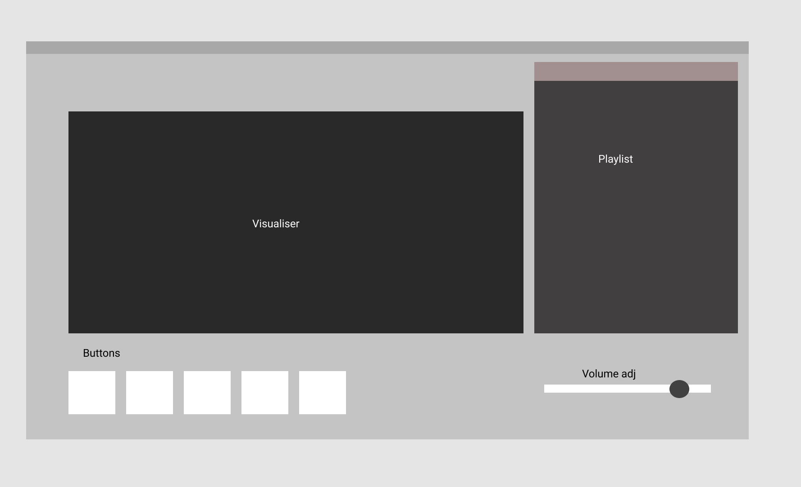

# Create a virtual environment
```python3 -m venv venv```

# Activate it
```source ./venv/bin/activate```

# Install Poetry
```pip install poetry```

# Install the project dependencies 
```poetry install```

# Update the project dependencies 
```poetry update```

## Format checks

```shell script
make lint - execute flake8

make black-check - run black check

make black - run black and format files

make mypy - run mypy on Viks-music-player and tests

```

##to run app:
```cd Viks-Music-Player```
```python3 main.py```


##User interface design 
